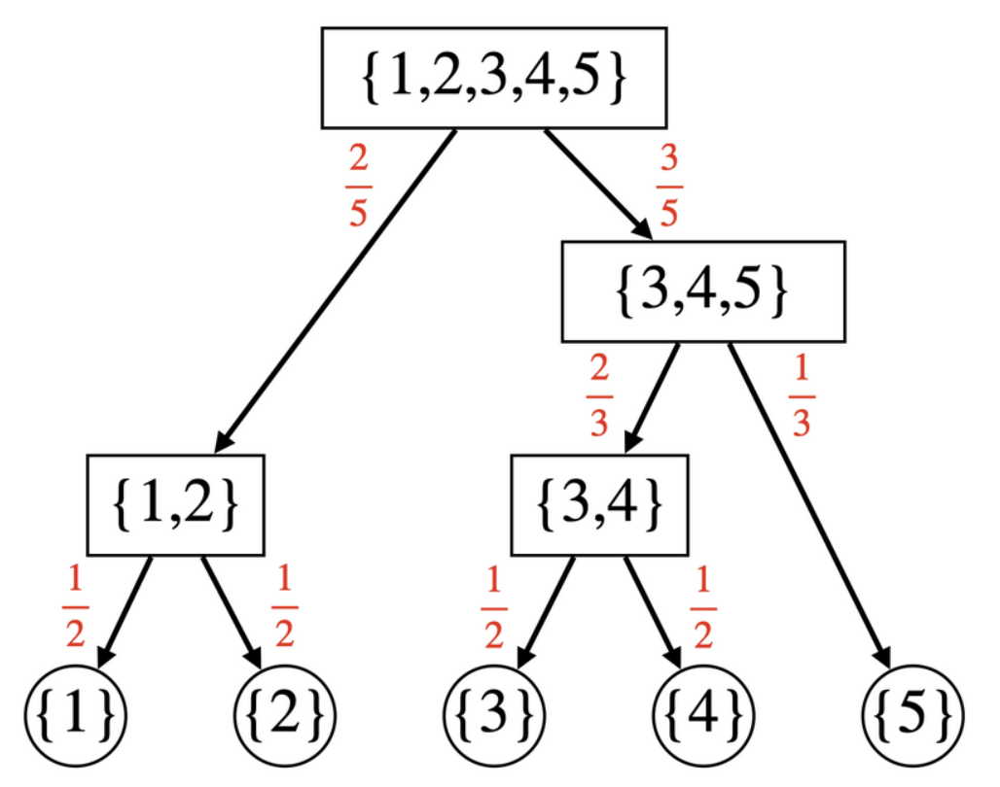

## A - 3.14

直接複製一下題目然後輸出就好了

```cpp
#include <bits/stdc++.h>

using namespace std;

typedef long long ll;
typedef pair<int, int> pii;
typedef pair<ll, ll> pll;
#define SZ(a) (int)(a).size()
#define ALL(v) (v).begin(), (v).end()
#define X first
#define Y second

#define dbg(x) cerr << #x << " = " << x << endl;

string pi = "3.1415926535897932384626433832795028841971693993751058209749445923078164062862089986280348253421170679";

void solve() {
  int n; cin >> n;
  for (int i = 0; i < n + 2; i++) cout << pi[i];
}

/*
CheckList:
1. long long
2. mod
3. template
4. input/output format/content
5. test sample input/output
*/
int main() {
  ios::sync_with_stdio(0);cin.tie(0);
  int T = 1;
  // cin >> T;
  while (T--) solve();
  return 0;
}
```

## B - Roulette

因為需要知道每個 [0, 36] 的輪盤有誰 bet，然後那個人 bet 了幾個，然後我懶得 sort 所以直接開 set （寫完後才意識到他其實只要看一個數字而已，所以 vector 存，最後再拿它出來 sort 就好），這樣他就幫我排序按照 bet 了幾個排序好了。

```cpp
#include <bits/stdc++.h>

using namespace std;

typedef long long ll;
typedef pair<int, int> pii;
typedef pair<ll, ll> pll;
#define SZ(a) (int)(a).size()
#define ALL(v) (v).begin(), (v).end()
#define X first
#define Y second

#define dbg(x) cerr << #x << " = " << x << endl;

set<pii> cnt[37];

void solve() {
  int n; cin >> n;
  for (int i = 1; i <= n; i++) {
    int c; cin >> c;
    for (int j = 0; j < c; j++) {
      int a; cin >> a;
      cnt[a].insert({c, i});
    }
  }
  int x; cin >> x;
  int betmn = cnt[x].begin()->X;
  vector<int> res;
  for (auto it = cnt[x].begin(); it != cnt[x].end(); it++) {
    if (it->X == betmn) {
      res.push_back(it->Y);
    } else {
      break;
    }
  }
  cout << SZ(res) << "\n";
  for (int r : res) cout << r << " ";
}

/*
CheckList:
1. long long
2. mod
3. template
4. input/output format/content
5. test sample input/output
*/
int main() {
  ios::sync_with_stdio(0);cin.tie(0);
  int T = 1;
  // cin >> T;
  while (T--) solve();
  return 0;
}
```

## C - Rotated Color Subsequence

因為對於每個顏色 [1, m] 就是往右移一個，所以可以直接把他們按照顏色存起來，然後按照原本的顏色順序從每一個顏色的最後一個開始輸出就好

```cpp
#include <bits/stdc++.h>

using namespace std;

typedef long long ll;
typedef pair<int, int> pii;
typedef pair<ll, ll> pll;
#define SZ(a) (int)(a).size()
#define ALL(v) (v).begin(), (v).end()
#define X first
#define Y second

#define dbg(x) cerr << #x << " = " << x << endl;

void solve() {
  int n, m; cin >> n >> m;
  string s; cin >> s;
  vector<int> c(n);
  vector<vector<char>> v(m + 1);
  for (int i = 0; i < n; i++) {
    cin >> c[i];
    v[c[i]].push_back(s[i]);
  }
  vector<int> ptrs(m + 1, 0);
  for (int i = 1; i <= m; i++) {
    ptrs[i] = SZ(v[i]) - 1;
  }
  for (int i = 0; i < n; i++) {
    cout << v[c[i]][ptrs[c[i]]];
    ptrs[c[i]] = (ptrs[c[i]] + 1) % SZ(v[c[i]]);
  }
}

/*
CheckList:
1. long long
2. mod
3. template
4. input/output format/content
5. test sample input/output
*/
int main() {
  ios::sync_with_stdio(0);cin.tie(0);
  int T = 1;
  // cin >> T;
  while (T--) solve();
  return 0;
}
```

## D - LOWER

對於所有在變成 upper/lower 之前的操作都只能算是改動字元，大小寫會被 upper/lower 的操作覆蓋掉。 upper/lower 的操作也會互相覆蓋，所以只要知道最後一個 upper/lower 的操作，然後把在他之前的改動字元改一下，然後全部變成 upper/lower，操作次序在這個「最後一個 upper/lower」後面的改動字元操作才會真的是那個字元，再拿出來改就好了。

```cpp
#include <bits/stdc++.h>

using namespace std;

typedef long long ll;
typedef pair<int, int> pii;
typedef pair<ll, ll> pll;
#define SZ(a) (int)(a).size()
#define ALL(v) (v).begin(), (v).end()
#define X first
#define Y second

#define dbg(x) cerr << #x << " = " << x << endl;

struct OP {
  int op_id, ind;
  char c;
  OP(int x = 0, int y = 0, char ch = '$') : op_id(x), ind(y), c(ch) {};
};

void solve() {
  int n; string s; cin >> n >> s;
  int q; cin >> q;
  int cnt = 0, last = -1; bool flag = 0;
  vector<OP> ops;
  for (int i = 1; i <= q; i++) {
    int op, ind; char c;
    cin >> op >> ind >> c;
    if (op == 1) {
      ind--;
      ops.push_back(OP(i, ind, c));
    } else if (op == 2) {
      flag = 1;
      cnt = 1;
      last = i;
    } else {
      flag = 1;
      cnt = 0;
      last = i;
    }
  }
  if (flag) {
    for (auto [op_id, ind, c] : ops) {
      if (op_id > last) break;
      s[ind] = c;
    }
    if (cnt) { // to lower
      for (int i = 0; i < n; i++) s[i] = tolower(s[i]);
    } else {
      for (int i = 0; i < n; i++) s[i] = toupper(s[i]);
    }
  }
  for (auto [op_id, ind, c] : ops) {
    if (op_id > last) s[ind] = c;
  }
  cout << s << "\n";
}

/*
CheckList:
1. long long
2. mod
3. template
4. input/output format/content
5. test sample input/output
*/
int main() {
  ios::sync_with_stdio(0);cin.tie(0);
  int T = 1;
  // cin >> T;
  while (T--) solve();
  return 0;
}
```

## E - Roulettes

對於 [1, m] 的點數我們可以去想說他從哪個輪盤轉移會最好，例如說一個輪盤有 1, 4, 6, 8, 這四個數字，那麼 $dp[i]$ 就可以從 $dp[i - 1], dp[i - 4], dp[i - 6], dp[i - 8] + c[j]$, where j = 輪盤編號。但是注意到這樣如果輪盤上存在 0 這個數字，那麽 $dp[i]$ 遞迴的時候就會錯。那要怎麼處理呢？

假設有 0, 4, 6, 8 這四個數字，列式原本會長這樣
$$dp[cost] = c_i + \frac{1}{4}dp[cost] + \frac{1}{4}dp[cost - 4] + \frac{1}{4}dp[cost - 6] + \frac{1}{4}dp[cost - 8]$$

移項之後就變成

$$\frac{3}{4}dp[cost] = c_i + \frac{1}{4}dp[cost - 4] + \frac{1}{4}dp[cost - 6] + \frac{1}{4}dp[cost - 8]$$

就再變成

$$dp[cost] = \frac{4}{3}c_i + \frac{1}{3}dp[cost - 4] + \frac{1}{3}dp[cost - 6] + \frac{1}{3}dp[cost - 8] $$

所以對於每個輪盤有 $p_i$ 個數字，其中有 $z$ 個 0 的話，$dp[cost]$ 其實會長成這樣

$$dp[cost] = \frac{p_i}{p_i - z}c_i + \frac{1}{p_i - z} \sum_{j = 1}^{p_i} dp[max(0, cost - s_{i, j})]$$

```cpp
#include <bits/stdc++.h>

using namespace std;

typedef long long ll;
typedef pair<int, int> pii;
typedef pair<ll, ll> pll;
#define SZ(a) (int)(a).size()
#define ALL(v) (v).begin(), (v).end()
#define X first
#define Y second

#define dbg(x) cerr << #x << " = " << x << endl;

const int N = 100 + 5;
const double inf = 1e18;
int c[N], p[N], s[N][N];
double dp[N];

void solve() {
  int n, m; cin >> n >> m;
  for (int i = 1; i <= n; i++) {
    cin >> c[i] >> p[i];
    for (int j = 1; j <= p[i]; j++) {
      cin >> s[i][j];
    }
  }
  for (int cost = 1; cost <= m; cost++) {
    dp[cost] = inf;
    for (int i = 1; i <= n; i++) {
      double d = 0;
      int z = 0;
      for (int j = 1; j <= p[i]; j++) {
        if (s[i][j] == 0) z++;
        else d += dp[max(0, cost - s[i][j])];
      }
      d += (double)c[i] * p[i];
      d /= (double)(p[i] - z);
      dp[cost] = min(dp[cost], d);
    }
  }
  cout << fixed << setprecision(15) << dp[m] << "\n";
}

/*
CheckList:
1. long long
2. mod
3. template
4. input/output format/content
5. test sample input/output
*/
int main() {
  ios::sync_with_stdio(0);cin.tie(0);
  int T = 1;
  // cin >> T;
  while (T--) solve();
  return 0;
}
```

## F - A Certain Game

可以參考題解的這張圖



我們可以用一個 dsu 來紀錄誰跟誰一組，那你會注意到 dsu 需要多開 $n - 1$ 個點來當比賽結果，然後把這些都弄成一棵樹，接下來從根開始 dfs，每次都把邊權下推，推到 [1, n] 的節點就是答案。

這邊要注意的實作細節是我的 dsu 寫法有 union by size，但是在這裡是不對的，我希望他要是特定的人當 father (aka 比賽結果)，所以不能 union by size。 debug 了好久 QQ

```cpp
#include <bits/stdc++.h>

using namespace std;

typedef long long ll;
typedef pair<int, int> pii;
typedef pair<ll, ll> pll;
#define SZ(a) (int)(a).size()
#define ALL(v) (v).begin(), (v).end()
#define X first
#define Y second

#define dbg(x) cerr << #x << " = " << x << endl;

const int M = 998244353;

struct DJS {
  int n;
  vector<int> p, sz;
  DJS(int _n) : n(_n) {
    p.resize(n);
    iota(ALL(p), 0);
    sz.assign(n, 1);
  }
  int find(int x) {
    return p[x] == x ? x : p[x] = find(p[x]);
  }
  void merge(int x, int y) {
    x = find(x), y = find(y);
    if (x == y) return;
    sz[y] += sz[x];
    p[x] = y;
  }
};

int pw(int a, int b) {
  int r = 1;
  while (b) {
    if (b & 1) r = 1ll * r * a % M;
    a = 1ll * a * a % M;
    b >>= 1;
  }
  return r;
}

int inv(int x){
  return pw(x, M - 2) % M;
}

int mul(int x, int y) {
  return 1ll * x * y % M;
}

const int N = 5e5 + 10;
vector<pii> g[N];

void solve() {
  int n; cin >> n;
  DJS djs(2 * n + 10);
  for (int i = n + 1; i <= 2 * n; i++) djs.sz[i] = 0;
  int ind = n;
  for (int i = 1; i < n; i++) {
    int u, v; cin >> u >> v;
    ind++;
    int pu = djs.find(u), pv = djs.find(v);
    int szu = djs.sz[pu], szv = djs.sz[pv];
    int tot = inv(szu + szv);
    g[ind].push_back({pu, mul(szu, tot)});
    g[ind].push_back({pv, mul(szv, tot)});
    djs.merge(u, ind);
    djs.merge(v, ind);
  }
  vector<int> res(n + 1);
  function<void(int, int)> dfs = [&](int u, int p) {
    if (u <= n) {
      res[u] = p; return;
    }
    for (auto [v, w] : g[u]) {
      //cerr << "u = " << u << ", v = " << v << ", w = " << w << endl;
      dfs(v, (p + w) % M);
    }
  };
  dfs(ind, 0);
  for (int i = 1; i <= n; i++) cout << res[i] << " \n"[i == n];
}

/*
CheckList:
1. long long
2. mod
3. template
4. input/output format/content
5. test sample input/output
*/
int main() {
  ios::sync_with_stdio(0);cin.tie(0);
  int T = 1;
  // cin >> T;
  while (T--) solve();
  return 0;
}
```

## 小 os

試著補完每一週的 ABC，其實蠻想打的但是週六培訓班完回家就死在地上ㄌ，所以盡量補 >< 可能也不會一次打完會慢慢更新，希望可以維持，加油！><
